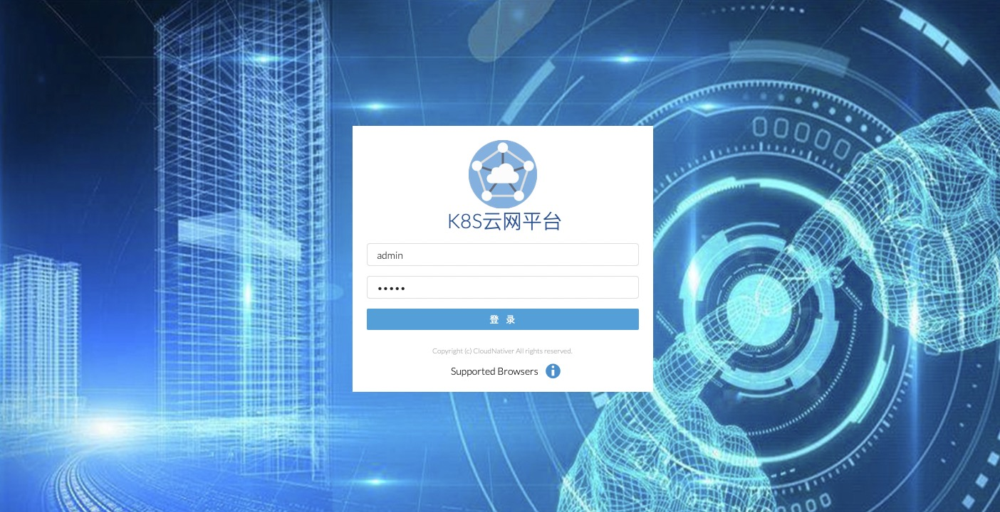
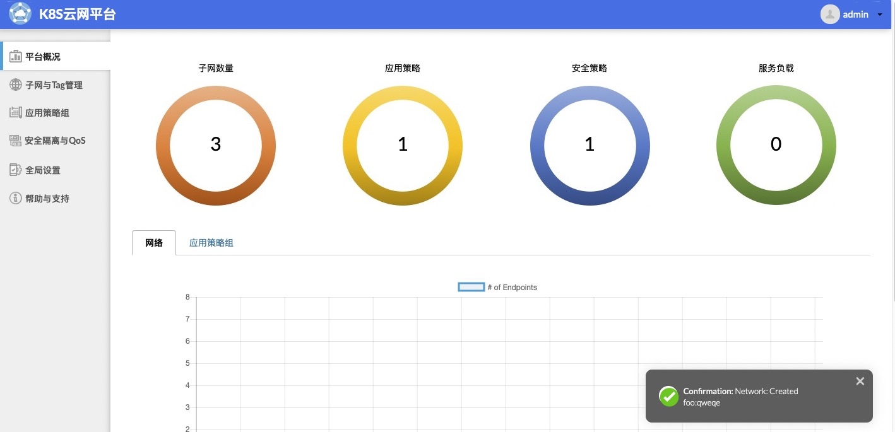
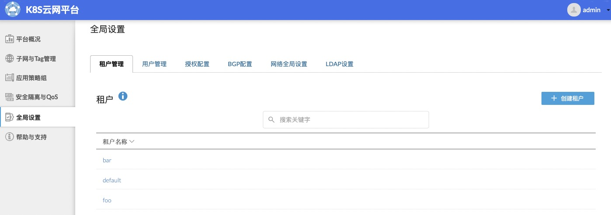
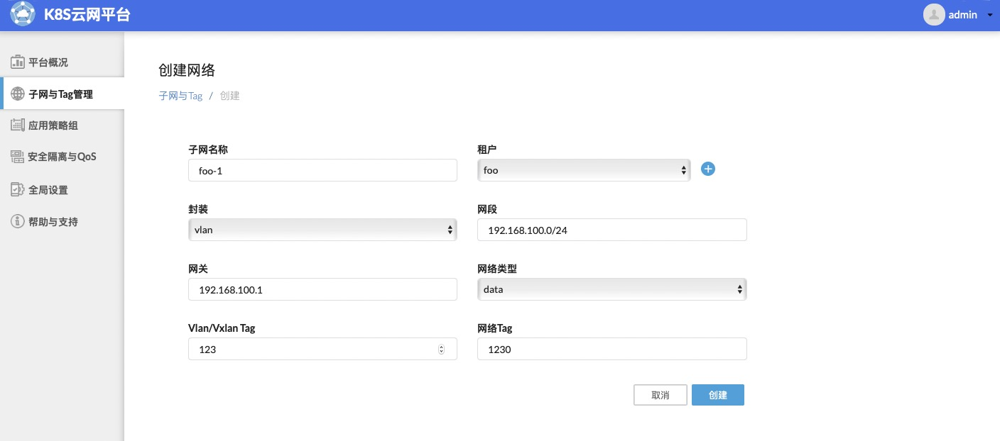
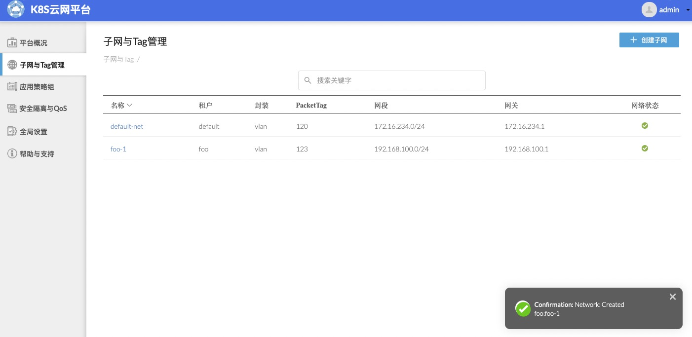
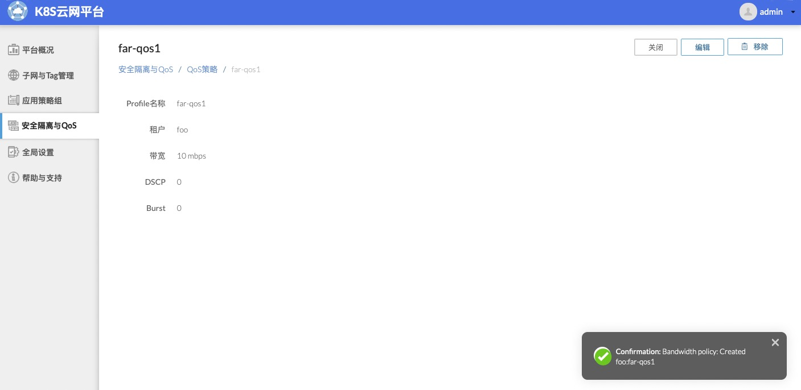

# 1  平台说明 / Brief overview
<a href="https://github.com/cloudnativer/k8s-contiv-ui">k8s-contiv-ui</a>是一款基于contiv-ui优化后的k8s云网编排管理平台，覆盖k8s网络中常用的多租户管理、子网管理、QoS带宽限速、安全隔离等功能，底层可以兼容VxLan和VLan网络架构。
k8s-contiv-ui已经全部支持中文版，可以非常方便母语为中文的个人或组织来使用。
<br>
K8s-contiv-ui is a kubernetes cloud network scheduling management platform based on contiv UI optimization.K8s-contiv-ui covers the functions commonly used in k8s network, such as multi tenant management, subnet management, QoS bandwidth limiting, security isolation and so on. The underlying layer can be compatible with vxlan and VLAN network architecture. K8s-contiv-ui fully supports Chinese, which can be used by individuals or organizations familiar with Chinese.


# 2  安装部署 / Installation
由于k8s-contiv-ui是底层是运行在<a href="https://github.com/contiv/netplugin">contiv-netplugin</a>这个CNI插件之上，所以请事先确保contiv-netplugin插件已经在你的k8s集群上正常运转。
<br>
Since k8s-contiv-ui is the underlying layer and runs on the CNI plug-in contiv-netplugin, please make sure that the contiv-netplugin plug-in is running normally on your k8s cluster.

## 2.1  制作镜像 / Making a mirror image

```
# docker load < basic-dep/images/auth-proxy-image.tar
# docker build -t k8s-contiv-ui:v0.1 . 

    Sending build context to Docker daemon  46.48MB
    Step 1/3 : FROM auth_proxy:1.2.0
     ---> b7435212f1b9
    Step 2/3 : COPY local_certs /local_certs
     ---> Using cache
     ---> 006809b01bc5
    Step 3/3 : COPY app /ui
     ---> Using cache
     ---> 8642a0708fb4
    Successfully built 8642a0708fb4
    Successfully tagged k8s-contiv-ui:v0.1
    
```

## 2.2  部署应用 / Deploy application

在k8s集群下创建k8s-contiv-ui
<br>
Creating k8s-contiv-ui in k8s cluster

` # kubectl apply -f yaml/k8s-contiv-ui.yaml `

## 2.3  登录使用 / Login

把k8s-contiv-ui服务暴露到k8s集群外，然后使用浏览器打开https://IP:1443
<br>
Expose the k8s-contiv-ui service outside the k8s cluster and open it with a browser https://IP:1443
<br>
输入默认的用户名(admin)和密码(admin)登录
<br>
Enter the default user name `admin` and password `admin` to login
<br>



<br>


# 3  功能介绍 / Function introduction

## 3.1  平台概况 / Platform overview

<br>



<br>

## 3.2  多租户管理 / Multi tenant management

<br>



<br>

## 3.3  子网管理 / Subnet management

<br>



<br>



<br>

## 3.4  QoS带宽隔离 / QoS bandwidth isolation

<br>



<br>


<br>

您可以实际安装部署来体验更多的功能！
<br>
You can actually install the deployment to experience more features!

<br>

<br>


