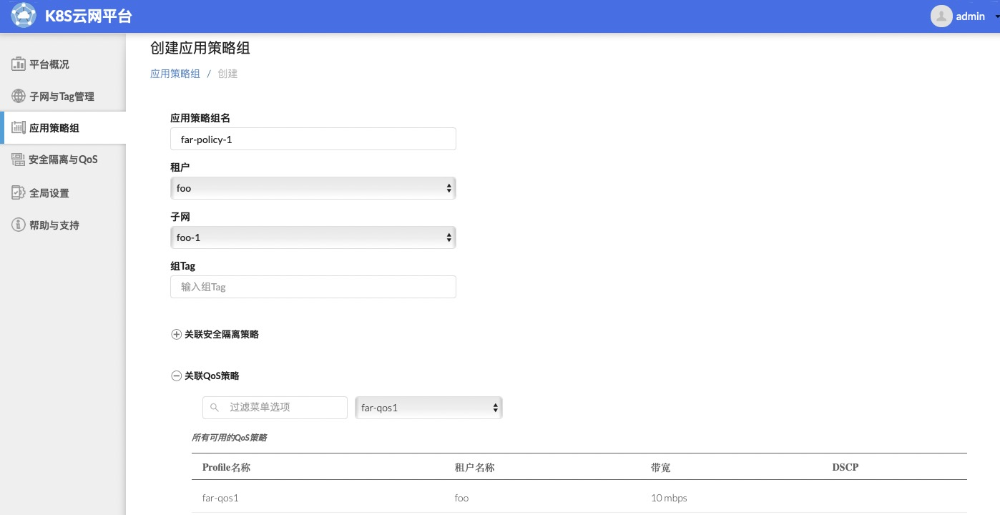

# 安装部署

## 制作镜像

```
# docker load < basic-dep/images/auth-proxy-image.tar
# docker build -t k8s-contiv-ui:v0.1 . 

Sending build context to Docker daemon  46.48MB
Step 1/3 : FROM auth_proxy:1.2.0
 ---> b7435212f1b9
Step 2/3 : COPY local_certs /local_certs
 ---> Using cache
 ---> 006809b01bc5
Step 3/3 : COPY app /ui
 ---> Using cache
 ---> 8642a0708fb4
Successfully built 8642a0708fb4
Successfully tagged k8s-contiv-ui:v0.1
```

## 部署应用

在k8s集群下创建k8s-contiv-ui

` kubectl apply -f yaml/k8s-contiv-ui.yaml `


# 功能介绍

## 租户管理

<br>


<br>

## 子网管理

<br>


<br>


<br>

## QoS隔离

<br>


<br>



<br>


